<div align="center">   

```

  ██████╗ ███╗   ██╗██████╗      ██████╗██╗  ██╗ █████╗ ██╗███╗   ██╗
  ██╔══██╗████╗  ██║██╔══██╗    ██╔════╝██║  ██║██╔══██╗██║████╗  ██║
  ██████╔╝██╔██╗ ██║██████╔╝    ██║     ███████║███████║██║██╔██╗ ██║
  ██╔══██╗██║╚██╗██║██╔══██╗    ██║     ██╔══██║██╔══██║██║██║╚██╗██║
  ██████╔╝██║ ╚████║██████╔╝    ╚██████╗██║  ██║██║  ██║██║██║ ╚████║
  ╚═════╝ ╚═╝  ╚═══╝╚═════╝     ╚═════╝╚═╝  ╚═╝╚═╝  ╚═╝╚═╝╚═╝  ╚═══╝
           █████╗ ██╗    ████████╗ ██████╗  ██████╗ ██╗     ██╗  ██╗██╗████████╗
          ██╔══██╗██║    ╚══██╔══╝██╔═══██╗██╔═══██╗██║     ██║ ██╔╝██║╚══██╔══╝
          ███████║██║       ██║   ██║   ██║██║   ██║██║     █████╔╝ ██║   ██║
          ██╔══██║██║       ██║   ██║   ██║██║   ██║██║     ██╔═██╗ ██║   ██║
          ██║  ██║██║       ██║   ╚██████╔╝╚██████╔╝███████╗██║  ██╗██║   ██║
          ╚═╝  ╚═╝╚═╝       ╚═╝    ╚═════╝  ╚═════╝ ╚══════╝╚═╝  ╚═╝╚═╝   ╚═╝
```

<h3>🔶 The most comprehensive open-source AI toolkit for BNB Chain</h3>

<br>

<a href="https://github.com/nirholas/bnb-chain-toolkit/blob/main/LICENSE"></a>
<a href="https://github.com/nirholas/bnb-chain-toolkit/stargazers"></a>
<a href="https://github.com/nirholas/bnb-chain-toolkit/network/members"></a>
<a href="https://github.com/nirholas/bnb-chain-toolkit/issues"></a>
<a href="https://github.com/nirholas/bnb-chain-toolkit"></a>
<a href="https://bnb-chain-toolkit.vercel.app/"></a>
<a href="HACKATHON.md"></a>

<br>


<br><br>

<a href="https://bnb-chain-toolkit.vercel.app/"><b>Live Demo</b></a> · 
<a href="#-quick-start">Quick Start</a> · 
<a href="docs/what-is-this.md">What Is This?</a> · 
<a href="#-components">Components</a> · 
<a href="docs/getting-started.md">Docs</a> · 
<a href="docs/examples.md">Examples</a> · 
<a href="docs/faq.md">FAQ</a>

<br>



</div>

---

## 🧐 What Is This?

**BNB Chain AI Toolkit** gives AI assistants superpowers on the blockchain.

It's a single repository with **everything** you need to build AI-powered applications on BNB Chain — agents, blockchain connectors, market data, DeFi tools, wallets, and Web3 standards. All open source.

**In plain English:** Imagine giving Claude or ChatGPT a crypto wallet, a trading terminal, and 72 expert advisors. That's what this toolkit does.

> **New to crypto or AI?** Start with our [What Is This?](docs/what-is-this.md) guide — written for non-technical people.

### Why This Toolkit?

| Problem | Solution |
|---------|----------|
| Fragmented BNB Chain tooling | **Single repo** with everything integrated |
| AI can't interact with blockchains | **6 MCP servers** give AI direct chain access |
| Complex DeFi interactions | **72+ specialized agents** for every protocol |
| Multi-chain complexity | **60+ chain support** with unified interfaces |
| No accessibility standards | **W3AG + ERC-8004** for inclusive Web3 |

---

## ⚡ Quick Start

[](https://stackblitz.com/github/nirholas/bnb-chain-toolkit)
[](https://codesandbox.io/s/github/nirholas/bnb-chain-toolkit)

```bash
# Clone
git clone https://github.com/nirholas/bnb-chain-toolkit.git
cd bnb-chain-toolkit

# Install & build
bun install && bun run build

# Start any MCP server
cd mcp-servers/bnbchain-mcp && bun install && bun start
```

### Use with Claude Desktop

Add to your `claude_desktop_config.json`:

```json
{
  "mcpServers": {
    "bnbchain": {
      "command": "npx",
      "args": ["-y", "@nirholas/bnbchain-mcp"],
      "env": {
        "BSC_RPC_URL": "https://bsc-dataseed.binance.org"
      }
    }
  }
}
```

> 📚 **Full setup guide:** [Getting Started](docs/getting-started.md)

---

## 🔗 Onchain Proof

ERC-8004 contracts are deployed and verified on **BSC Mainnet**, **BSC Testnet**, **opBNB Mainnet**, **opBNB Testnet**, and **20 additional chains** (24 total).

### BSC Mainnet (Chain ID: 56)

| Contract | Address | Explorer |
|----------|---------|----------|
| **IdentityRegistry** | `0x8004A169FB4a3325136EB29fA0ceB6D2e539a432` | [BscScan →](https://bscscan.com/address/0x8004A169FB4a3325136EB29fA0ceB6D2e539a432) |
| **ReputationRegistry** | `0x8004BAa17C55a88189AE136b182e5fdA19dE9b63` | [BscScan →](https://bscscan.com/address/0x8004BAa17C55a88189AE136b182e5fdA19dE9b63) |

### BSC Testnet (Chain ID: 97)

| Contract | Address | Explorer |
|----------|---------|----------|
| **IdentityRegistry** | `0x8004A818BFB912233c491871b3d84c89A494BD9e` | [BscScan →](https://testnet.bscscan.com/address/0x8004A818BFB912233c491871b3d84c89A494BD9e) |
| **ReputationRegistry** | `0x8004B663056A597Dffe9eCcC1965A193B7388713` | [BscScan →](https://testnet.bscscan.com/address/0x8004B663056A597Dffe9eCcC1965A193B7388713) |
| **ValidationRegistry** | `0x8004Cb1BF31DAf7788923b405b754f57acEB4272` | [BscScan →](https://testnet.bscscan.com/address/0x8004Cb1BF31DAf7788923b405b754f57acEB4272) |

### opBNB Testnet (Chain ID: 5611)

| Contract | Address | Explorer |
|----------|---------|----------|
| **IdentityRegistry** | `0x8004A818BFB912233c491871b3d84c89A494BD9e` | [opBNBScan →](https://testnet.opbnbscan.com/address/0x8004A818BFB912233c491871b3d84c89A494BD9e) |
| **ReputationRegistry** | `0x8004B663056A597Dffe9eCcC1965A193B7388713` | [opBNBScan →](https://testnet.opbnbscan.com/address/0x8004B663056A597Dffe9eCcC1965A193B7388713) |
| **ValidationRegistry** | `0x8004Cb1BF31DAf7788923b405b754f57acEB4272` | [opBNBScan →](https://testnet.opbnbscan.com/address/0x8004Cb1BF31DAf7788923b405b754f57acEB4272) |

### opBNB Mainnet (Chain ID: 204)

| Contract | Address | Explorer |
|----------|---------|----------|
| **IdentityRegistry** | `0x8004A169FB4a3325136EB29fA0ceB6D2e539a432` | [opBNBScan →](https://opbnbscan.com/address/0x8004A169FB4a3325136EB29fA0ceB6D2e539a432) |
| **ReputationRegistry** | `0x8004BAa17C55a88189AE136b182e5fdA19dE9b63` | [opBNBScan →](https://opbnbscan.com/address/0x8004BAa17C55a88189AE136b182e5fdA19dE9b63) |

> 📋 **First deployment TX:** [`0xfc55d83d...dc1962`](https://testnet.bscscan.com/tx/0xfc55d83d20e6d92ff522f302fd3424d3fd5557f25c06f4bfc38ecf3246dc1962) on BSC Testnet
>
> All addresses share the deterministic `0x8004` vanity prefix (CREATE2 via SAFE Singleton Factory).
> Full 24-chain deployment list: [`erc8004-agents/docs/contracts.md`](erc8004-agents/docs/contracts.md) | Machine-readable: [`bsc.address`](bsc.address)

---

## 🏆 Hackathon

Built for the **BNB Chain "Good Vibes Only: OpenClaw Edition"** hackathon — Track 1: Agent.

> **[Full Submission → HACKATHON.md](HACKATHON.md)** | **[Live Demo →](https://bnb-chain-toolkit.vercel.app/)**

### What Makes This Unique

| # | Feature | Details |
|---|---------|---------|
| 1 | **Comprehensive Coverage** | No other project covers the entire BNB Chain AI stack |
| 2 | **Production-Ready MCP** | 6 servers, 900+ tools, ready for Claude and other LLMs |
| 3 | **Original Standards** | ERC-8004 (agent trust) and W3AG (accessibility) |
| 4 | **Real DeFi Tooling** | Dust sweeper, market data, wallet toolkit |
| 5 | **72+ Specialized Agents** | Purpose-built for every major BNB protocol |
| 6 | **30+ Languages** | Global accessibility with 30+ translations |

### Hackathon Submission Docs

| Document | Description |
|----------|-------------|
| [`HACKATHON.md`](HACKATHON.md) | **Primary submission document** — on-chain proof, architecture, reproduction steps |
| [`bsc.address`](bsc.address) | Deployed contract addresses (JSON) |
| [`docs/PROJECT.md`](docs/PROJECT.md) | Problem, solution, impact, roadmap |
| [`docs/TECHNICAL.md`](docs/TECHNICAL.md) | Architecture, setup, demo guide |
| [`docs/AI_BUILD_LOG.md`](docs/AI_BUILD_LOG.md) | How AI was used to build this |
| [`docs/EXTRAS.md`](docs/EXTRAS.md) | Demo video, slides, live links |

---

## 🏗️ Architecture

```
bnb-chain-toolkit/
├── agents/                     # 🤖 72+ AI Agent definitions
│   ├── bnb-chain-agents/       #    30 BNB Chain-specific agents
│   └── defi-agents/            #    42 general DeFi agents (18 languages)
│
├── mcp-servers/                # 🔌 6 Model Context Protocol servers
│   ├── bnbchain-mcp/           #    BNB Chain + EVM (100+ tools)
│   ├── binance-mcp/            #    Binance.com (478+ tools)
│   ├── binance-us-mcp/         #    Binance.US (US compliance)
│   ├── universal-crypto-mcp/   #    60+ networks (100+ tools)
│   ├── agenti/                 #    Universal EVM + Solana
│   └── ucai/                   #    ABI-to-MCP generator (Python)
│
├── market-data/                # 📊 Market data & news
│   ├── crypto-market-data/     #    CoinGecko, DeFiLlama, Fear & Greed
│   └── crypto-news/            #    200+ sources, 150+ endpoints
│
├── defi-tools/                 # 🧹 DeFi utilities
│   └── sweep/                  #    Multi-chain dust sweeper
│
├── wallets/                    # 👛 Wallet tooling
│   └── ethereum-wallet-toolkit/#    Offline-capable, BSC compatible
│
├── standards/                  # 📜 Web3 standards
│   ├── erc-8004/               #    Agent discovery & trust protocol
│   └── w3ag/                   #    Web3 Accessibility Guidelines
│
└── docs/                       # 📖 Comprehensive documentation
```

> 📐 **Deep dive:** [Architecture Guide](docs/architecture.md)

---

## 🧩 Components

### 🤖 AI Agents (72+)

Pre-built agent definitions for every major BNB Chain protocol and DeFi use case.

<details>
<summary><b>BNB Chain Agents (30)</b> — Click to expand</summary>

| Agent | Description |
|-------|-------------|
| **PancakeSwap Trader** | DEX trading, liquidity, yield farming on PancakeSwap v3 |
| **Venus Protocol Expert** | Lending, borrowing, liquidation on Venus |
| **BNB Staking Advisor** | Liquid staking optimization across validators |
| **Binance Earn Specialist** | Savings, staking, Launchpool yields |
| **BSC Bridge Navigator** | Cross-chain bridging (BSC ↔ opBNB ↔ L2s) |
| **BEP-20 Token Analyst** | Token security, smart money tracking |
| **Binance Copy Trading** | Mirror top performers' strategies |
| **opBNB Scaling Expert** | L2 gas optimization |
| **Greenfield Storage** | Decentralized storage on BNB Greenfield |
| **Thena DEX Expert** | ve(3,3) DEX trading on Thena |
| + 20 more... | Full ecosystem coverage |

</details>

<details>
<summary><b>DeFi Agents (42)</b> — Click to expand</summary>

| Category | Count | Examples |
|----------|:-----:|---------|
| Portfolio Management | 8 | Tracking, rebalancing, tax optimization |
| Trading Automation | 7 | Grid trading, DCA, arbitrage, signals |
| Yield Optimization | 6 | Auto-compounding, IL protection |
| Risk & Security | 5 | Auditing, rug detection |
| Market Intelligence | 5 | Sentiment, whale tracking |
| DeFi Protocols | 6 | Lending, DEX, derivatives |
| Infrastructure | 5 | Bridge, gas, RPC, indexing |

</details>

> 📚 **Full guide:** [Agents Documentation](docs/agents.md)

---

### 🔌 MCP Servers (6)

Model Context Protocol servers that give AI assistants direct blockchain access.

| Server | Tools | What It Does |
|--------|:-----:|-------------|
| **BNB Chain MCP** | 100+ | BSC, opBNB, Greenfield — swaps, transfers, contracts |
| **Binance MCP** | 478+ | Spot, futures, margin trading on Binance.com |
| **Binance US MCP** | — | US regulatory-compliant Binance access |
| **Universal Crypto MCP** | 100+ | 60+ networks, cross-chain DeFi |
| **Agenti** | — | EVM + Solana, AI-to-AI payments (x402) |
| **UCAI** | Dynamic | Turn any smart contract ABI into an MCP server |

```bash
# One-command ABI-to-MCP conversion
ucai generate --abi ./Contract.json --chain bsc --output ./my-server
```

> 📚 **Full guide:** [MCP Servers Documentation](docs/mcp-servers.md)

---

### 📊 Market Data

| Component | Sources | Features |
|-----------|:-------:|---------|
| **Crypto Market Data** | CoinGecko, DeFiLlama, Fear & Greed | Zero-dependency, Edge Runtime compatible |
| **Crypto News** | 200+ sources | 150+ endpoints, sentiment analysis, MCP server |

```typescript
// Quick example
const btc = await CoinGecko.getPrice('bitcoin');
const fear = await FearAndGreed.getIndex();
console.log(`BTC: $${btc.usd} | Sentiment: ${fear.classification}`);
```

> 📚 **Full guide:** [Market Data Documentation](docs/market-data.md)

---

### 🧹 DeFi Tools

**Dust Sweeper** — Scan 8 chains for tiny token balances, batch-swap them into stablecoins.

```bash
bun run scan --wallet 0xYourAddress --chain bsc    # Preview (safe)
bun run sweep --wallet 0xYourAddress --target USDC  # Execute
```

> 📚 **Full guide:** [DeFi Tools Documentation](docs/defi-tools.md)

---

### 👛 Wallets

**Ethereum Wallet Toolkit** — Offline-capable, BSC-compatible wallet operations.

- HD wallet generation (BIP-39/44)
- Vanity address generation
- Message signing (EIP-191, EIP-712)
- Transaction signing (legacy + EIP-1559)
- Keystore V3 import/export

> 📚 **Full guide:** [Wallets Documentation](docs/wallets.md)

---

### 📜 Standards

| Standard | Description |
|----------|-------------|
| **ERC-8004** | On-chain AI agent discovery, reputation, and trust protocol |
| **W3AG** | Web3 Accessibility Guidelines — making DeFi accessible to all |

> 📚 **Full guide:** [Standards Documentation](docs/standards.md)

---

## 🌐 Supported Networks

| Network | Type | Status |
|---------|------|:------:|
| **BNB Smart Chain (BSC)** | L1 | ✅ |
| **opBNB** | L2 | ✅ |
| **BNB Greenfield** | Storage | ✅ |

---

## 📊 Tool Summary

| Category | Count | Source |
|----------|------:|--------|
| BNB Chain on-chain tools | 100+ | bnbchain-mcp |
| Binance exchange tools | 478+ | binance-mcp |
| Cross-chain DeFi tools | 100+ | universal-crypto-mcp |
| EVM chain tools | 50+ | agenti |
| ABI-to-MCP generation | Dynamic | ucai |
| Market data endpoints | 150+ | crypto-news + crypto-market-data |
| Wallet operations | 20+ | ethereum-wallet-toolkit |
| **Total** | **900+** | |

---

## 🛠️ Development

```bash
bun install           # Install dependencies
bun run build         # Build agent index
bun run format        # Format agent JSONs
bun run lint          # Lint TypeScript
bun run test          # Run tests
bun run type-check    # Type checking
```

### Adding a New Agent

```bash
cp agents/bnb-chain-agents/agent-template.json agents/bnb-chain-agents/my-agent.json
# Edit the file, then:
bun run build
```

> 📚 **Full guide:** [Creating Agents](docs/agents.md#creating-your-own-agent)

---

## 📖 Documentation

| Guide | For | Description |
|-------|-----|-------------|
| [What Is This?](docs/what-is-this.md) | Everyone | Simple explanation, no jargon |
| [Getting Started](docs/getting-started.md) | Beginners | 5-minute setup |
| [Architecture](docs/architecture.md) | Developers | System design & data flows |
| [Agents](docs/agents.md) | Users | Complete agent catalog |
| [MCP Servers](docs/mcp-servers.md) | Developers | Server setup & configuration |
| [Market Data](docs/market-data.md) | Developers | Price feeds & news APIs |
| [DeFi Tools](docs/defi-tools.md) | Users | Dust sweeping & utilities |
| [Wallets](docs/wallets.md) | Users | Wallet generation & signing |
| [Standards](docs/standards.md) | Researchers | ERC-8004 & W3AG specs |
| [Examples](docs/examples.md) | Everyone | Real-world usage patterns |
| [FAQ](docs/faq.md) | Everyone | Common questions |
| [Troubleshooting](docs/troubleshooting.md) | Everyone | Problem solving |
| [Awesome List](docs/awesome.md) | Everyone | Curated resources |

---

## 🤝 Contributing

Contributions are welcome! Whether it's a new agent, a bug fix, documentation improvement, or a new MCP server.

1. Fork the repo
2. Create your branch: `git checkout -b feat/my-improvement`
3. Commit: `git commit -m "✨ feat: add amazing feature"`
4. Push: `git push origin feat/my-improvement`
5. [Open a Pull Request](https://github.com/nirholas/bnb-chain-toolkit/pulls)

> 📚 **Full guide:** [CONTRIBUTING.md](CONTRIBUTING.md)

---

## 📄 License

MIT © [nirholas](https://github.com/nirholas)

---

<p align="center">
  <b>Built with 🔶 for BNB Chain</b><br>
  <sub>72+ agents · 6 MCP servers · 900+ tools · 60+ chains · 30+ languages</sub>
</p>

<p align="center">
  <br>
  ⭐ <b>Found this useful? Star the repo!</b> ⭐<br>
  <sub>It helps others discover this project and keeps development active</sub><br><br>
  <a href="https://github.com/nirholas/bnb-chain-toolkit/stargazers">
    
  </a>
</p>

