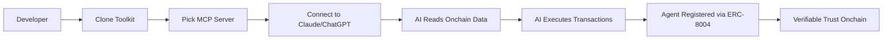
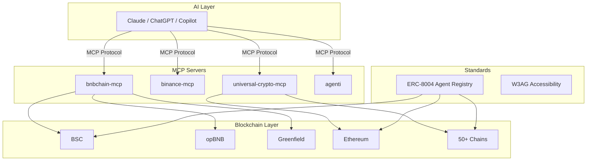

# BNB Chain AI Toolkit — Project Document

> Hackathon submission for **Good Vibes Only: OpenClaw Edition**
> Track: **Builders** (Tools that help other developers ship faster)

| Field         | Details                                                    |
| ------------- | ---------------------------------------------------------- |
| **Project**   | BNB Chain AI Toolkit                                       |
| **Author**    | nich (nirholas)                                            |
| **GitHub**    | https://github.com/nirholas/bnb-chain-toolkit             |
| **Live Demo** | https://bnb-chain-toolkit.vercel.app/                      |
| **Agent Creator** | https://erc8004.agency/                                |
| **License**   | MIT                                                        |
| **Stack**     | TypeScript, Python, Solidity, Bun, Vite                    |

---

## 1. Problem

Building AI-powered applications on BNB Chain today is harder than it should be. We identified five concrete problems that slow down developers, limit adoption, and create security gaps.

### 1.1 Fragmented BNB Chain Tooling

There is no single comprehensive resource for building AI-powered applications on BNB Chain. Developers must piece together dozens of separate libraries, APIs, SDKs, and documentation sources. Each tool covers a narrow slice — a DEX aggregator here, an RPC provider there, a wallet SDK somewhere else. The integration burden falls entirely on the developer.

This fragmentation means:

- Weeks of setup before writing any business logic
- Incompatible interfaces between tools from different providers
- No shared patterns or conventions across the ecosystem
- Duplicated effort across every team building on BNB Chain

### 1.2 AI Cannot Interact with Blockchains Natively

Large language models like Claude, ChatGPT, and Copilot have no native way to read onchain data, execute transactions, or understand DeFi protocol mechanics. The gap between AI capability and blockchain execution is massive. An AI can explain how Uniswap works but cannot check a pool's TVL, execute a swap, or verify a transaction receipt.

Without a structured bridge between AI and onchain systems, every developer has to build their own integration layer from scratch — and most don't.

### 1.3 No Standard for AI Agent Identity

AI agents acting onchain have no verifiable identity. There is no reputation system, no registration mechanism, and no way to establish trust. Anyone can deploy a contract claiming to be an AI agent. Users and protocols have no way to distinguish a legitimate agent from a malicious one.

This creates real risks:

- Agent impersonation and phishing
- No accountability for agent actions
- No way to build composable trust between agents
- Protocols cannot whitelist or rate-limit agents based on reputation

### 1.4 Multi-Chain Complexity

BNB Chain itself spans multiple networks — BSC (Layer 1), opBNB (Layer 2), and Greenfield (decentralized storage). Beyond that, developers frequently need cross-chain interoperability with Ethereum, Base, Arbitrum, Polygon, Solana, and dozens of others. Each chain has different RPCs, gas models, tooling, and quirks.

Building a multi-chain AI application means maintaining separate integrations for every target network — an exponentially growing maintenance burden.

### 1.5 Accessibility Barriers

Web3 interfaces are notoriously difficult to use. There are no established accessibility standards for blockchain UIs, wallets, or dApps. This excludes users with visual, motor, cognitive, or other disabilities — millions of potential participants shut out of the ecosystem.

---

## 2. Solution

BNB Chain AI Toolkit is a monorepo that provides everything a developer needs to build AI-powered applications on BNB Chain and 60+ other networks. It addresses each problem directly.

### 2.1 Single Monorepo with Everything Integrated

One repository. 72+ AI agents, 6 MCP servers, 900+ tools, market data services, DeFi utilities, wallet operations, and Web3 standards — all MIT licensed, all designed to work together.

```
bnb-chain-toolkit/
├── agents/           # 72+ AI agent definitions (JSON)
│   ├── bnb-chain-agents/   # 30 BNB Chain-specific agents
│   └── defi-agents/        # 42 general DeFi agents
├── mcp-servers/      # 6 Model Context Protocol servers
│   ├── bnbchain-mcp/       # BNB Chain + EVM (TypeScript)
│   ├── binance-mcp/        # Binance.com exchange (TypeScript)
│   ├── binance-us-mcp/     # Binance.US (TypeScript)
│   ├── universal-crypto-mcp/  # 60+ networks (TypeScript)
│   ├── agenti/             # Universal EVM + Solana (TypeScript)
│   └── ucai/               # ABI-to-MCP generator (Python)
├── market-data/      # Price feeds and news aggregation
├── defi-tools/       # DeFi utilities (dust sweeper)
├── wallets/          # Offline wallet operations
├── standards/        # ERC-8004 + W3AG specifications
├── erc8004-agents/   # Agent registry platform
├── agent-runtime/    # Execution runtime (in progress)
└── locales/          # 30+ language translations
```

A developer can clone the repo and have a working AI agent with onchain capabilities in under five minutes.

### 2.2 Six MCP Servers Give AI Direct Chain Access

Model Context Protocol (MCP) servers are the core bridge between AI and blockchains. Each server exposes a structured tool interface that any MCP-compatible LLM (Claude, ChatGPT, Copilot, etc.) can call directly.

| MCP Server             | Scope                          | Tools |
| ---------------------- | ------------------------------ | ----- |
| `bnbchain-mcp`         | BSC, opBNB, Greenfield + EVM   | 150+  |
| `binance-mcp`          | Binance.com exchange API        | 200+  |
| `binance-us-mcp`       | Binance.US exchange API         | 100+  |
| `universal-crypto-mcp` | 60+ networks                   | 300+  |
| `agenti`               | Universal EVM + Solana          | 100+  |
| `ucai`                 | ABI-to-MCP generator (Python)  | —     |

Install and run with a single command:

```bash
npx @nirholas/bnbchain-mcp
```

These servers let AI:

- Query balances, token metadata, and transaction history
- Execute swaps on DEXes (PancakeSwap, Uniswap, etc.)
- Interact with arbitrary smart contracts
- Fetch real-time market data and news
- Manage wallet operations

### 2.3 ERC-8004: On-Chain AI Agent Identity

We authored ERC-8004, an original Ethereum standard for registering AI agents as ERC-721 NFTs with built-in reputation scoring. Each registered agent gets:

- A unique on-chain identity (NFT)
- Immutable metadata (capabilities, version, author)
- A reputation score updated by verified interactions
- Cross-chain portability via standard ERC-721 interfaces

ERC-8004 contracts are deployed and live on **24 chains**, including BSC mainnet and opBNB. The [Agent Creator](https://erc8004.agency/) provides a UI for registering agents without writing code.

### 2.4 Unified Multi-Chain Architecture

All MCP servers share a standardized interface pattern. A developer writes one integration and gets access to 60+ networks. Chain-specific logic is encapsulated inside each server — the AI-facing API remains consistent regardless of the target chain.

Supported networks include BSC, opBNB, Greenfield, Ethereum, Base, Arbitrum, Optimism, Polygon, Avalanche, Fantom, Solana, and 50+ others.

### 2.5 W3AG: Web3 Accessibility Guidelines

We authored W3AG (Web3 Accessibility Guidelines), an original standard for making Web3 interfaces accessible to users with disabilities. The toolkit includes 30+ language translations to support global adoption.

### 2.6 User Journey



### 2.7 Architecture Overview



---

## 3. Business & Ecosystem Impact

### 3.1 Target Users

- **AI developers** building agents that need onchain capabilities
- **DeFi builders** who want AI-assisted protocol interaction
- **Protocol teams** on BNB Chain looking to add AI features
- **Non-technical users** who interact with AI assistants for blockchain tasks

### 3.2 Ecosystem Value

We lower the barrier to building AI-powered BNB Chain applications from weeks of integration work to minutes. A developer can go from zero to a working AI agent with onchain capabilities by running a single `npx` command.

The toolkit is designed as infrastructure — it makes every other BNB Chain project easier to build, not just our own.

### 3.3 Adoption Path

MCP servers are published to npm and ready for immediate use:

```bash
# BNB Chain-specific server
npx @nirholas/bnbchain-mcp

# 60+ network universal server
npx @nirholas/universal-crypto-mcp
```

No complex setup. No vendor lock-in. One command, and any MCP-compatible AI has access to BNB Chain.

### 3.4 Two Original Web3 Standards

We contributed two new standards that benefit the broader ecosystem:

1. **ERC-8004** — On-chain AI agent identity and reputation. Gives agents verifiable identities as ERC-721 NFTs. Deployed on 24 chains.
2. **W3AG** — Web3 Accessibility Guidelines. A framework for making blockchain interfaces usable by everyone, including people with disabilities.

These standards are independent of our toolkit — any project can adopt them.

### 3.5 Deployment Scale

ERC-8004 contracts are live on 24 chains:

- BNB Smart Chain (BSC) mainnet
- Ethereum mainnet
- Base, Arbitrum, Optimism, Polygon
- And 16 additional networks

This creates a cross-chain agent identity layer where an agent registered on BSC can be verified on any other deployed chain.

### 3.6 Open Source Sustainability

The entire project is MIT licensed and designed for community contribution. We provide:

- Agent templates for creating new agents
- Comprehensive documentation
- Clear contribution guidelines
- 30+ language translations via the locales system

---

## 4. Limitations & Future Work

### 4.1 Current Limitations

| Limitation | Detail |
| --- | --- |
| **ERC-8004 draft status** | The standard is in proposal stage — it has not been adopted as a finalized ERC. Community review and iteration are ongoing. |
| **API key requirements** | Some MCP server features (particularly Binance exchange operations) require API keys. Onchain read operations work without keys. |
| **Static agent definitions** | Agent definitions are JSON files — they define capabilities declaratively but do not learn, adapt, or update at runtime. |
| **Test coverage** | Root-level test coverage is minimal. Individual MCP servers have their own test suites, but end-to-end coverage needs improvement. |
| **No formal audit** | ERC-8004 smart contracts have not undergone a formal security audit. |

### 4.2 Short-Term Roadmap

- **opBNB deployment** for ERC-8004 — extend agent identity to BNB Chain's L2
- **Agent runtime** — the `agent-runtime/` package is in active development, providing actual execution capabilities for agent definitions
- **Expanded test suite** — comprehensive unit, integration, and end-to-end tests
- **CI/CD pipeline** — automated testing, linting, and deployment on every pull request

### 4.3 Long-Term Roadmap

- **ERC-8004 formal EIP submission** — submit through the official Ethereum Improvement Proposal process with community review
- **Agent-to-agent communication** — a protocol for registered agents to discover, negotiate with, and delegate tasks to each other
- **On-chain agent marketplace** — a registry where users can discover, compare, and hire AI agents based on reputation scores
- **Autonomous execution framework** — integration with OpenClaw and similar runtimes for fully autonomous agent operation
- **Greenfield integration** — use BNB Greenfield for decentralized storage of agent metadata, logs, and training data

### 4.4 Open Questions

- What governance model best serves ERC-8004 standard evolution? A DAO, a multisig council, or informal consensus?
- How should reputation scores be weighted? On-chain activity volume vs. accuracy vs. user ratings?
- What is the optimal gas strategy for reputation updates on BSC — batch updates, L2 rollups, or off-chain computation with on-chain anchoring?

---

## References

- [Repository](https://github.com/nirholas/bnb-chain-toolkit)
- [Live Demo](https://bnb-chain-toolkit.vercel.app/)
- [Agent Creator (ERC-8004)](https://erc8004.agency/)
- [ERC-8004 Specification](../erc8004.md)
- [W3AG Standard](../standards/)
- [Documentation](./README.md)
- [npm: @nirholas/bnbchain-mcp](https://www.npmjs.com/package/@nirholas/bnbchain-mcp)
- [npm: @nirholas/universal-crypto-mcp](https://www.npmjs.com/package/@nirholas/universal-crypto-mcp)
