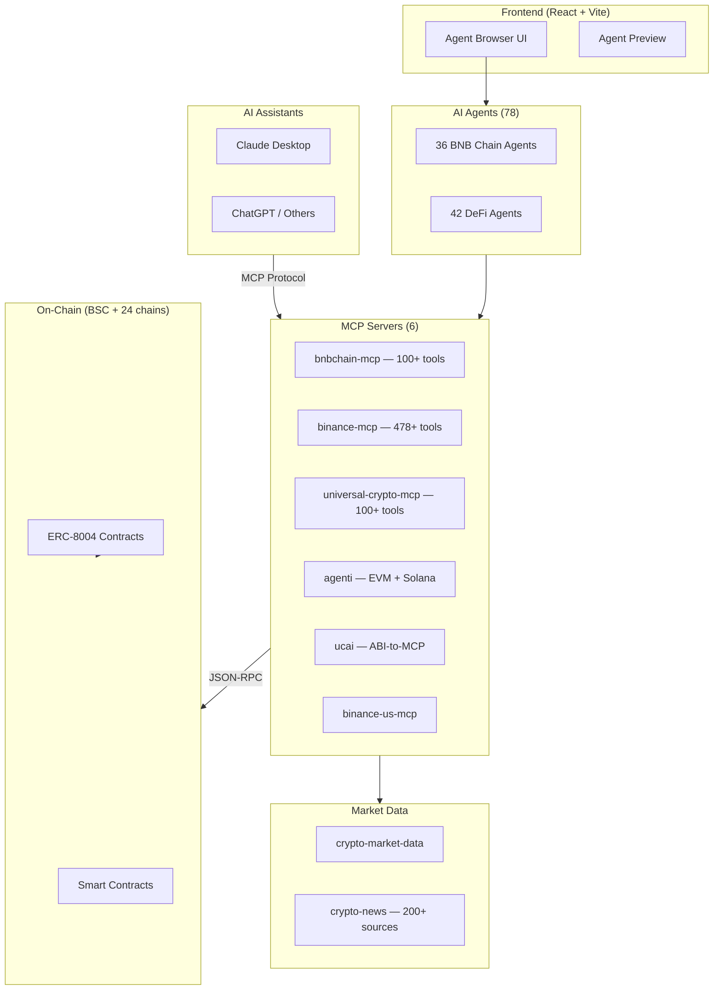
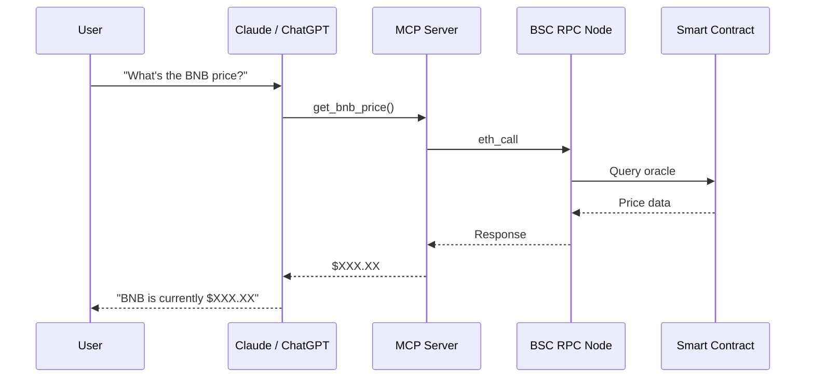
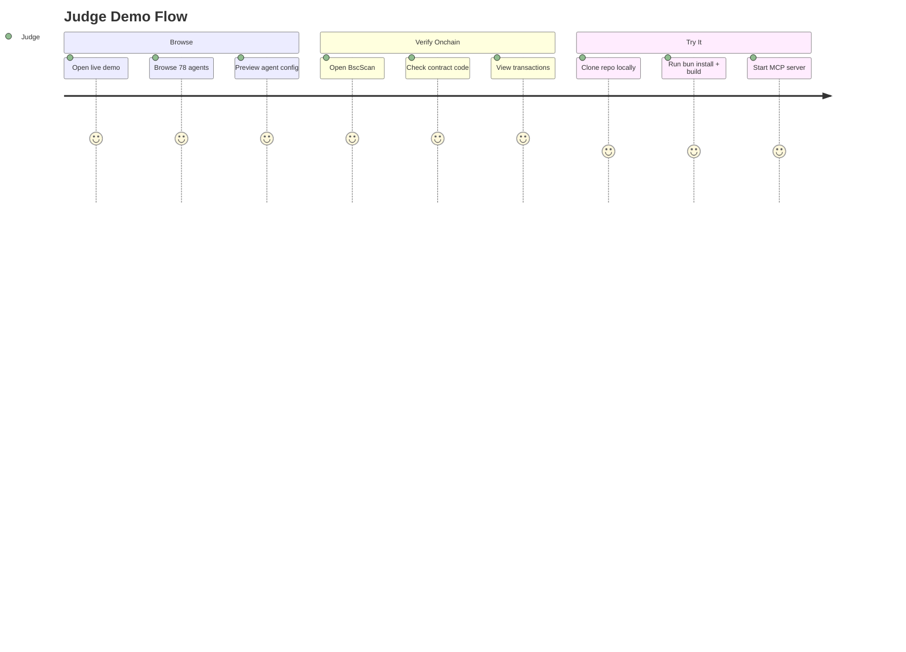

# Technical Document — BNB Chain AI Toolkit

> Hackathon submission: 78 AI agents, 6 MCP servers, 900+ tools for BNB Chain and 60+ networks.

---

## Table of Contents

1. [Architecture](#1-architecture)
2. [Setup & Run](#2-setup--run)
3. [Demo Guide](#3-demo-guide)

---

## 1. Architecture

### System Overview

BNB Chain AI Toolkit is a monorepo with **7 major components**:

| Component | Count | Description |
|-----------|-------|-------------|
| **AI Agents** | 78 | JSON-defined agent personas for LLMs |
| **MCP Servers** | 6 | Model Context Protocol bridges to blockchains |
| **Market Data** | 2 libraries | Price feeds + news aggregation (200+ sources) |
| **DeFi Tools** | 1 (dust sweeper) | Multi-chain token sweeping utility |
| **Wallets** | 1 toolkit | Offline-capable wallet operations |
| **Standards** | 2 (ERC-8004 + W3AG) | On-chain agent identity + web3 accessibility |
| **Frontend** | React + Vite | Agent browser UI with live preview |

### Component Diagram



### Data Flow



### Component Details

#### AI Agents (`agents/`)

- **36 BNB Chain agents** — PancakeSwap trading, Venus lending, BNB staking, BSC security audit, opBNB L2, Greenfield storage, and more.
- **42 DeFi agents** — General-purpose agents for trading, bridging, yield farming, portfolio management across 60+ networks.
- Each agent is a self-contained **JSON file** with: system prompt, MCP server connections, opening questions, and metadata.
- Build pipeline: `src/*.json` → schema validation → `public/index.json` (searchable API).
- Key files: `agents/bnb-chain-agents/`, `agents/defi-agents/`, `schema/`, `scripts/`.

#### MCP Servers (`mcp-servers/`)

| Server | Language | Tools | Scope |
|--------|----------|-------|-------|
| `bnbchain-mcp` | TypeScript | 100+ | BNB Chain + EVM operations |
| `binance-mcp` | TypeScript | 478+ | Binance.com exchange (spot, futures, earn) |
| `binance-us-mcp` | TypeScript | — | Binance.US (US-compliant subset) |
| `universal-crypto-mcp` | TypeScript | 100+ | 60+ networks via unified interface |
| `agenti` | TypeScript | — | EVM + Solana multi-chain |
| `ucai` | Python | — | ABI-to-MCP code generator |

Each server implements the [Model Context Protocol](https://modelcontextprotocol.io/) and can be used with Claude Desktop, ChatGPT, or any MCP-compatible client.

#### Market Data (`market-data/`)

- **crypto-market-data** — Zero-dependency TypeScript library. Sources: CoinGecko, DeFiLlama, Fear & Greed Index. Built-in TTL caching.
- **crypto-news** — Aggregates from 200+ sources. Supports filtering by chain, token, and category.

#### DeFi Tools (`defi-tools/sweep/`)

Multi-chain dust sweeper that consolidates small token balances into a single asset. Supports BSC, Ethereum, Polygon, and more.

#### Wallets (`wallets/`)

Offline-capable Ethereum/BSC wallet toolkit. Key generation, signing, and address derivation — all without network access.

#### Standards (`standards/`)

- **ERC-8004** — On-chain AI agent identity protocol. Contracts: `IdentityRegistry`, `ReputationRegistry`, `ValidationRegistry`. Agents are registered as ERC-721 NFTs.
- **W3AG** — Web3 Accessibility Guidelines for inclusive dApp design.

#### Frontend (`src/`, `index.html`)

React 19 + Vite + Tailwind CSS. Features: agent catalog browser, live agent preview with Monaco editor, category filtering, search, and dark mode.

### On-Chain vs Off-Chain

| Layer | Components | Details |
|-------|-----------|---------|
| **On-chain** | ERC-8004 contracts | `IdentityRegistry`, `ReputationRegistry`, `ValidationRegistry` deployed on BSC mainnet/testnet + 20 other chains. Deterministic addresses via CREATE2. |
| **Off-chain** | Everything else | Agent JSON definitions, MCP server logic, market data aggregation, frontend UI, wallet toolkit. |

### Security

- **Smart contracts** use CREATE2 deterministic deployment via the SAFE Singleton Factory — same address on every chain.
- **All contracts verified** on block explorers (BscScan, Etherscan, etc.).
- **MCP servers are read-heavy** — write operations (transactions) require explicit user confirmation.
- **No private keys stored in repo** — users provide their own via environment variables.
- **Agent definitions are inert JSON** — no code execution, safe to inspect and share.

---

## 2. Setup & Run

### Prerequisites

| Tool | Version | Purpose | Install |
|------|---------|---------|---------|
| Node.js | 18+ | Runtime | [nodejs.org](https://nodejs.org/) |
| bun | latest | Package manager & runner | [bun.sh](https://bun.sh/) |
| Git | any | Clone repo | [git-scm.com](https://git-scm.com/) |

Verify your environment:

```bash
node --version   # Should print v18.x or higher
bun --version    # Should print 1.x
git --version    # Any version
```

### Environment Variables

No API keys are required for basic setup. Optional variables for extended features:

| Variable | Purpose | Default |
|----------|---------|---------|
| `BSC_RPC_URL` | Custom BSC RPC endpoint | Public endpoint (`https://bsc-dataseed.binance.org`) |
| `BINANCE_API_KEY` | Binance exchange features | — |
| `BINANCE_SECRET` | Binance exchange features | — |
| `COINGECKO_API_KEY` | Higher rate limits on market data | — |

### Install & Build

```bash
git clone https://github.com/nirholas/bnb-chain-toolkit.git
cd bnb-chain-toolkit
bun install
bun run build
```

`bun run build` compiles TypeScript and generates `public/index.json` — the searchable agent index.

### Run Each Component

```bash
# Frontend (agent browser)
bun run dev
# Opens at http://localhost:5173

# BNB Chain MCP Server
cd mcp-servers/bnbchain-mcp && bun install && bun start

# Universal Crypto MCP (one-command, no clone needed)
npx -y @anthropic/universal-crypto-mcp

# Run tests
bun run test

# Lint
bun run lint
```

### Docker

```bash
docker-compose up
# Frontend: http://localhost:3000
# Backend:  http://localhost:3001
```

The Docker stack includes the frontend (Nginx), backend API server, and optional Redis caching.

### Claude Desktop Integration

Add to your `claude_desktop_config.json`:

```json
{
  "mcpServers": {
    "bnbchain": {
      "command": "npx",
      "args": ["-y", "@nirholas/bnbchain-mcp"],
      "env": {
        "BSC_RPC_URL": "https://bsc-dataseed.binance.org"
      }
    }
  }
}
```

Claude can now call 100+ BNB Chain tools directly in conversation.

### Verify Installation

```bash
# Confirm agent index was built
cat public/index.json | head -20
# Should output JSON with agent definitions

# Confirm MCP server responds
curl -X POST http://localhost:3000/mcp -d '{"method":"tools/list"}'
```

---

## 3. Demo Guide

### Access Points

| Method | URL | Setup Required |
|--------|-----|----------------|
| **Live demo** (no setup) | [bnb-chain-toolkit.vercel.app](https://bnb-chain-toolkit.vercel.app/) | None |
| **Agent Creator** | [erc8004.agency](https://erc8004.agency/) | None |
| **MCP playground** | [mcp.ucai.tech](https://mcp.ucai.tech) | None |
| **Local** | `bun run dev` → http://localhost:5173 | Clone + install |

### Judge Demo Flow — Step by Step

#### Step 1: Browse the Agent Catalog

1. Open [https://bnb-chain-toolkit.vercel.app/](https://bnb-chain-toolkit.vercel.app/)
2. Browse the **78 agent catalog** — filter by BNB Chain or DeFi.
3. Click any agent to preview its system prompt, MCP server connections, and opening questions.

#### Step 2: Explore the ERC-8004 Agent Creator

4. Visit [https://erc8004.agency/](https://erc8004.agency/) to see the ERC-8004 Agent Creator.
5. Connect a wallet (MetaMask on BSC) to register an AI agent as an on-chain NFT.

#### Step 3: Verify On-Chain Contracts

6. Check contract verification on BscScan: [0x8004A169FB4a3325136EB29fA0ceB6D2e539a432](https://bscscan.com/address/0x8004A169FB4a3325136EB29fA0ceB6D2e539a432)

### Key Actions to Try

| Action | Where |
|--------|-------|
| Browse agents by category (trading, staking, bridging, security) | Live demo |
| Preview full agent configurations | Live demo |
| Check MCP server tool lists | mcp.ucai.tech |
| Verify on-chain contracts on BscScan | BscScan link above |
| Register a test agent on BSC Testnet | erc8004.agency |

### Expected Outcomes

- **Agent browser**: All 78 agents display with full configs (system prompt, MCP connections, opening questions).
- **MCP servers**: Combined 900+ tools across 6 servers.
- **On-chain**: Contracts verified on BscScan, deterministic addresses via CREATE2.
- **Agent registration**: Mints an ERC-721 NFT representing the agent's on-chain identity.

### Demo Flow Diagram



### Troubleshooting

| Problem | Solution |
|---------|----------|
| `bun: command not found` | Install bun: `curl -fsSL https://bun.sh/install \| bash` then restart your terminal |
| Port 5173 already in use | Kill existing process or use `bun run dev -- --port 5174` |
| MetaMask on wrong network | Switch to BSC Mainnet (Chain ID `56`) or BSC Testnet (Chain ID `97`) |
| Need testnet BNB | Use faucet: [testnet.bnbchain.org/faucet-smart](https://testnet.bnbchain.org/faucet-smart) |
| `public/index.json` missing | Run `bun run build` — this generates the agent index |
| MCP server won't start | Ensure you ran `bun install` inside the MCP server directory first |

---

## Technology Stack

| Layer | Technology | Purpose |
|-------|-----------|---------|
| Agent Definitions | JSON + JSON Schema | Portable, validated agent configs |
| MCP Servers | TypeScript / Node.js | AI ↔ blockchain bridges |
| UCAI Generator | Python | ABI-to-MCP code generation |
| Market Data | TypeScript (zero-dep) | Price feeds + news aggregation |
| Smart Contracts | Solidity / Foundry | ERC-8004 on-chain identity |
| Frontend | React 19 + Vite + Tailwind | Agent browser UI |
| Package Manager | bun | Fast installs + script execution |
| Translations | JSON (i18n) | 30+ languages |
| Deployment | Vercel / Docker / Nginx | Production hosting |

---

## Links

| Resource | URL |
|----------|-----|
| Live Demo | [bnb-chain-toolkit.vercel.app](https://bnb-chain-toolkit.vercel.app/) |
| Agent Creator | [erc8004.agency](https://erc8004.agency/) |
| MCP Playground | [mcp.ucai.tech](https://mcp.ucai.tech) |
| GitHub | [github.com/nirholas/bnb-chain-toolkit](https://github.com/nirholas/bnb-chain-toolkit) |
| ERC-8004 Contract | [BscScan](https://bscscan.com/address/0x8004A169FB4a3325136EB29fA0ceB6D2e539a432) |
| BSC Testnet Faucet | [testnet.bnbchain.org/faucet-smart](https://testnet.bnbchain.org/faucet-smart) |
