<div align="center">



<br>

<br>

<a href="https://github.com/nirholas/erc8004-agent-creator/blob/main/LICENSE"></a>
<a href="https://github.com/nirholas/erc8004-agent-creator/stargazers"></a>
<a href="https://github.com/nirholas/erc8004-agent-creator/network/members"></a>
<a href="https://github.com/nirholas/erc8004-agent-creator/issues"></a>
<a href="https://github.com/nirholas/erc8004-agent-creator"></a>
<a href="https://erc8004.agency/"></a>

<br>


<br><br>

<a href="https://erc8004.agency/"><b>▶ Launch App</b></a> · 
<a href="#-quick-start">Quick Start</a> · 
<a href="#-what-is-erc-8004">What Is ERC-8004?</a> · 
<a href="#-features">Features</a> · 
<a href="docs/">Docs</a> · 
<a href="#-how-it-works">How It Works</a> · 
<a href="docs/faq.md">FAQ</a>

</div>

---

## 🧐 What Is ERC-8004?

**ERC-8004** gives AI agents a **portable, on-chain identity** — like a passport for the agent economy.

It's a standard for **discovering, choosing, and interacting with agents across organizational boundaries** without pre-existing trust. No API keys. No vendor lock-in. Just smart contracts.

**In plain English:** Your AI agent gets an NFT (ERC-721) that says who it is, what it can do, and where to reach it. Anyone can verify it on-chain. Forever.

> **New to Web3?** Start with our [What Is ERC-8004?](docs/what-is-erc8004.md) guide — written in plain English.

### Why ERC-8004?

| Problem | Solution |
|---------|----------|
| Agents can't prove who they are | **On-chain identity** via ERC-721 NFT |
| No standard way to discover agents | **Three registries** — Identity, Reputation, Validation |
| Trust requires centralized directories | **Trustless verification** on any EVM chain |
| Agent metadata disappears when hosts go down | **Immutable on-chain storage** (base64 data URIs) |
| No interoperability between agent protocols | **Multi-protocol** — A2A, MCP, OASF, ENS, DID |

---

## ⚡ Quick Start

**Option 1: Just use it** (recommended)

Visit **[erc8004.agency](https://erc8004.agency/)** → Connect wallet → Create agent → Done.

**Option 2: Run locally**

```bash
git clone https://github.com/nirholas/erc8004-agent-creator.git
cd erc8004-agent-creator
open index.html
# That's literally it. No npm. No build. No config.
```

**Option 3: Self-host**

Drop `index.html` on Vercel, Netlify, GitHub Pages, IPFS, or any static host. One file.

> 📚 **Full setup guide:** [Getting Started](docs/getting-started.md)

---

## ✨ Features

<table>
<tr>
<td width="50%">

### 🔗 Wallet & Network
- One-click MetaMask connection
- BSC Testnet & Mainnet switching
- Mainnet safety warnings
- Disconnect button
- Gas estimation on review step

</td>
<td width="50%">

### 🧙 Step-by-Step Wizard
- Agent identity (name, description, image)
- Multi-service endpoints (A2A, MCP, OASF…)
- Trust model configuration
- Review & deploy with gas estimate

</td>
</tr>
<tr>
<td width="50%">

### 📦 Storage Options
- On-chain URI (base64 data URI — no hosting)
- IPFS support
- HTTPS support
- Custom on-chain metadata key-value pairs

</td>
<td width="50%">

### 📊 Agent Dashboard
- View all your registered agents
- Ownership verification
- Token ID & metadata display
- Direct BscScan links

</td>
</tr>
</table>

---

## 🏗️ How It Works

```
┌─────────────────────────────────────────────────────────────┐
│                    ERC-8004 Agent Creator                    │
│                                                             │
│  ┌──────────┐  ┌──────────┐  ┌──────────┐  ┌──────────┐   │
│  │ 1. Agent  │→ │2. Service│→ │3. Config │→ │4. Deploy │   │
│  │ Identity  │  │Endpoints │  │  & Trust │  │ On-Chain │   │
│  └──────────┘  └──────────┘  └──────────┘  └──────────┘   │
│       │                                          │          │
│       ▼                                          ▼          │
│  Name, Desc,                              register() call   │
│  Image URL                                on IdentityRegistry│
│                                                │            │
│                                                ▼            │
│                                     ERC-721 NFT minted      │
│                                     to your wallet          │
└─────────────────────────────────────────────────────────────┘
```

1. **Connect wallet** — MetaMask or any injected Web3 wallet
2. **Fill in agent details** — Name, description, image, services
3. **Configure trust models** — Reputation, crypto-economic, TEE attestation
4. **Deploy on-chain** — Calls `register()` on the ERC-8004 IdentityRegistry
5. **Get your Agent ID** — An ERC-721 NFT minted to your address

<details>
<summary><b>📄 Example registration JSON</b> — Click to expand</summary>

```json
{
  "type": "https://eips.ethereum.org/EIPS/eip-8004#registration-v1",
  "name": "My AI Agent",
  "description": "An agent that does amazing things",
  "image": "https://example.com/avatar.png",
  "services": [
    {
      "name": "A2A",
      "endpoint": "https://agent.example/.well-known/agent-card.json",
      "version": "0.3.0"
    },
    {
      "name": "MCP",
      "endpoint": "https://mcp.agent.example/",
      "version": "2025-06-18"
    }
  ],
  "active": true,
  "registrations": [
    {
      "agentId": 42,
      "agentRegistry": "eip155:97:0x8004A818BFB912233c491871b3d84c89A494BD9e"
    }
  ],
  "supportedTrust": ["reputation"]
}
```

</details>

---

## 📜 Contract Addresses

### BSC Testnet (Chain ID: 97)

| Contract | Address | Explorer |
|---|---|---|
| **IdentityRegistry** | `0x8004A818...BD9e` | [View ↗](https://testnet.bscscan.com/address/0x8004A818BFB912233c491871b3d84c89A494BD9e) |
| **ReputationRegistry** | `0x8004B663...8713` | [View ↗](https://testnet.bscscan.com/address/0x8004B663056A597Dffe9eCcC1965A193B7388713) |
| **ValidationRegistry** | `0x8004Cb1B...4272` | [View ↗](https://testnet.bscscan.com/address/0x8004Cb1BF31DAf7788923b405b754f57acEB4272) |

### BSC Mainnet (Chain ID: 56)

| Contract | Address | Explorer |
|---|---|---|
| **IdentityRegistry** | `0x8004A169...a432` | [View ↗](https://bscscan.com/address/0x8004A169FB4a3325136EB29fA0ceB6D2e539a432) |
| **ReputationRegistry** | `0x8004BAa1...9b63` | [View ↗](https://bscscan.com/address/0x8004BAa17C55a88189AE136b182e5fdA19dE9b63) |

> All contracts use **CREATE2 vanity deployment** with `0x8004` prefix via the SAFE Singleton Factory.

### Ethereum & Sepolia

| Network | Contract | Address | Explorer |
|---|---|---|---|
| **Mainnet** | IdentityRegistry | `0x8004A169...a432` | [View ↗](https://etherscan.io/address/0x8004A169FB4a3325136EB29fA0ceB6D2e539a432) |
| **Mainnet** | ReputationRegistry | `0x8004BAa1...9b63` | [View ↗](https://etherscan.io/address/0x8004BAa17C55a88189AE136b182e5fdA19dE9b63) |
| **Sepolia** | IdentityRegistry | `0x8004A818...BD9e` | [View ↗](https://sepolia.etherscan.io/address/0x8004A818BFB912233c491871b3d84c89A494BD9e) |
| **Sepolia** | ReputationRegistry | `0x8004B663...8713` | [View ↗](https://sepolia.etherscan.io/address/0x8004B663056A597Dffe9eCcC1965A193B7388713) |

---

## 🛠️ Tech Stack

| Component | Choice | Why |
|-----------|--------|-----|
| **Build system** | None | Just open the file |
| **Dependencies** | Zero | Nothing to install or update |
| **Framework** | Vanilla JS | No React, Vue, or Angular |
| **Blockchain** | Ethers.js v6 (CDN) | Industry standard, loaded on demand |
| **Fonts** | Inter + JetBrains Mono | Google Fonts CDN |
| **Styling** | CSS Custom Properties | Themeable, no preprocessor |
| **File count** | 1 | Single `index.html` — that's the whole app |

---

## 📖 Documentation

| Guide | For | Description |
|-------|-----|-------------|
| [What Is ERC-8004?](docs/what-is-erc8004.md) | Everyone | Plain-English explainer |
| [Getting Started](docs/getting-started.md) | Beginners | 5-minute first agent |
| [Architecture](docs/architecture.md) | Developers | Smart contract design |
| [Contracts](docs/contracts.md) | Developers | All deployed addresses |
| [Examples](docs/examples.md) | Everyone | Beginner → advanced recipes |
| [Tutorials](docs/tutorials.md) | Everyone | Step-by-step guides |
| [Integration](docs/integration.md) | Developers | Embed, iframe, React hook |
| [FAQ](docs/faq.md) | Everyone | Common questions |
| [Troubleshooting](docs/troubleshooting.md) | Everyone | Problem solving |

---

## 🔗 Links

| | |
|---|---|
| **▶ Live App** | [erc8004.agency](https://erc8004.agency/) |
| **📋 ERC-8004 Spec** | [8004.org](https://www.8004.org) |
| **📦 Contracts Repo** | [erc-8004/erc-8004-contracts](https://github.com/erc-8004/erc-8004-contracts) |
| **🧾 First Testnet TX** | [BscScan ↗](https://testnet.bscscan.com/tx/0xfc55d83d20e6d92ff522f302fd3424d3fd5557f25c06f4bfc38ecf3246dc1962) |

---

## 🤝 Contributing

Contributions welcome! Whether it's a bug fix, new feature, or documentation improvement.

1. Fork the repo
2. Create your branch: `git checkout -b feat/my-improvement`
3. Commit: `git commit -m "✨ feat: add amazing feature"`
4. Push: `git push origin feat/my-improvement`
5. [Open a Pull Request](https://github.com/nirholas/erc8004-agent-creator/pulls)

---

## 📄 License

Apache 2.0 © [nirholas](https://github.com/nirholas)

---

<p align="center">
  <b>Built with 🔶 for the agent economy</b><br>
  <sub>Zero deps · Single file · On-chain forever · ERC-8004 standard</sub>
</p>

<p align="center">
  <br>
  ⭐ <b>Found this useful? Star the repo!</b> ⭐<br>
  <sub>It helps others discover ERC-8004 and keeps development active</sub><br><br>
  <a href="https://github.com/nirholas/erc8004-agent-creator/stargazers">
    
  </a>
</p>
